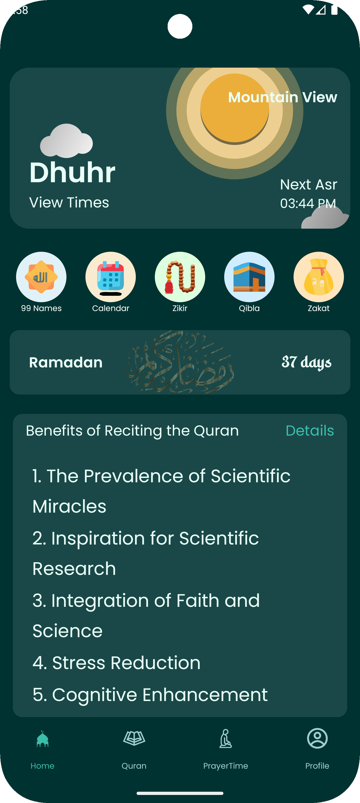
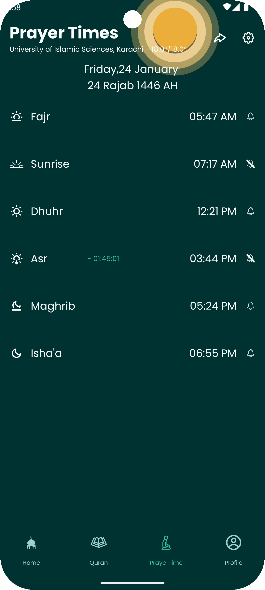
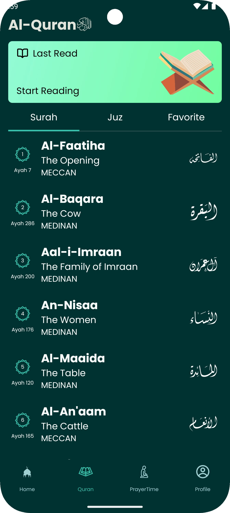
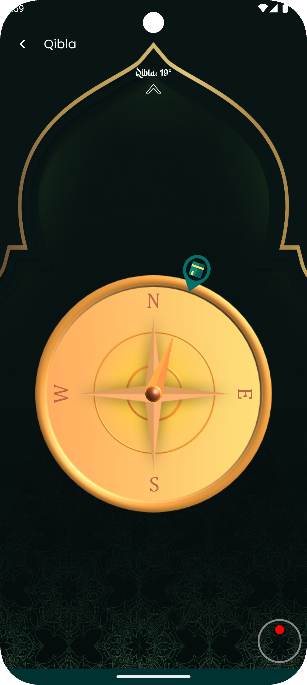
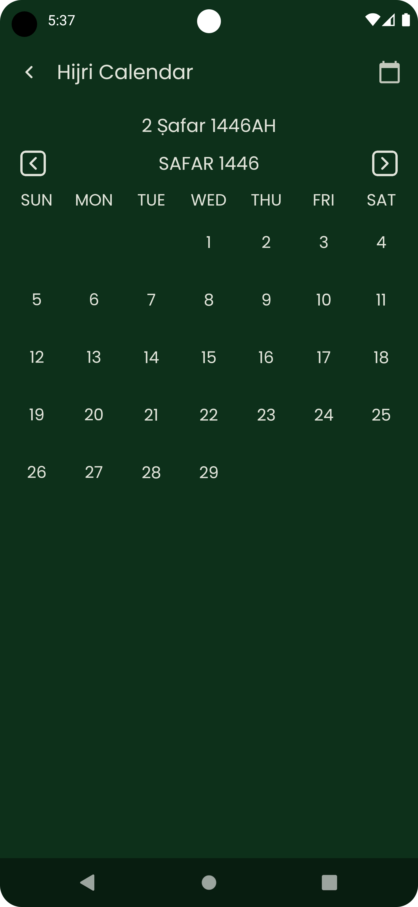

# Islam 24 Application

**Embrace the Serenity of Faith with Islamic 24**

Discover a seamless and intuitive Islamic app crafted to enhance your spiritual journey. **Islam 24** offers a clutter-free experience with no ad interruptions, allowing you to focus entirely on your prayers and religious obligations.

  

---

## Key Features:
- **Accurate Prayer Times**: Stay punctual with precise prayer timings based on your location.
- **Islamic Calendar**: Never miss important Islamic dates and events.
- **Zikr & Tasbih**: Keep track of your supplications and dhikr with ease.
- **No Ads**: Enjoy a seamless experience without any interruptions.
- **No Tracker**: Your privacy is our priority.

---

## Screenshots

    
    
    
    
    

---

## Roadmap

**Current Features:**
1.  **Prayer Times:** Accurate prayer times based on your location.
2.  **Islamic Calendar:** Keep track of important Islamic dates.
3.  **Zikr:** A collection of supplications and remembrances.
4.  **Tasbih:** Digital counter for your Tasbih needs.
5.  **Qibla Direction:** Easy-to-use Qibla compass to find the direction of the Kaaba.
6.   **User Profile:** Customize your profile within the app.
7.   **Zakat Calculator:** Calculate your Zakat with ease.
8.   ** Quran Reading** Read the Holy Al-Quran, save last read
---

**Upcoming Features:**
1.  **Duas:** A comprehensive collection of daily Duas.
2.  **Islamic Quiz:** Test your knowledge with Islamic quizzes.
3.  **Nearby Halal Places:** Find Halal restaurants and shops near you.
4.  **Nearby Masjids:** Locate the closest Masjids for prayer.

---

## Credits
#### **Icons**

The icons used in this app are sourced from the following Figma icon packs:

- [Stratis UI Icons - 1000+ Free Figma Icons](https://www.figma.com/design/4cMgtPKTUF4Kzz3QZxGRsq/Stratis-UI-Icons---1000%2B-Free-Figma-icons-(Community)?m=auto&t=wHGViASVSJGGHiyq-1) by Stratis UI
- [Icons - Free Icons 65,000+](https://www.figma.com/design/TLNLk6CMdno4Uf3dJgo4hX/Icons---Free-Icons-65%2C000-(Community)?m=auto&t=wHGViASVSJGGHiyq-1) by Various Designers
- [icons8](https://icons8.com/) For Readme Features icons

We greatly appreciate the work of these creators in making these icons available to the community.

#### **Fonts**
- [Arabic Text Fonts](https://github.com/quran/quran_android/tree/main/app/src/main/assets) From Quran Android Git Repository

### Quran Data Attribution

This project includes various Quran data files in JSON format, sourced from the following repositories and API:

#### Quran Arabic Data
- **Source:** [alquran.cloud API](https://alquran.cloud/api)
- **File:** `quran_ar.json`
- This file contains the Arabic text of the Quran, provided through the [alquran.cloud](https://alquran.cloud/api) API.

#### Quran English, Bengali, and Transliteration Data
- **Source:** [Risan's Quran JSON Repository](https://github.com/risan/quran-json)
- **Files:**
    - `quran_en.json`: English translation of the Quran.
    - `quran_bn.json`: Bengali translation of the Quran.
    - `quran_transliteration.json`: Transliteration of the Quranic text.
- These files were sourced from the [Quran JSON repository](https://github.com/risan/quran-json) by [Risan](https://github.com/risan).

- [Quran Bengali Surah name](https://allzinone.blogspot.com/2011/12/bengali-meaning-of-name-of-suras-of.html) : From  Everything in a Place website

We thank the respective authors and platforms for providing these valuable resources.

