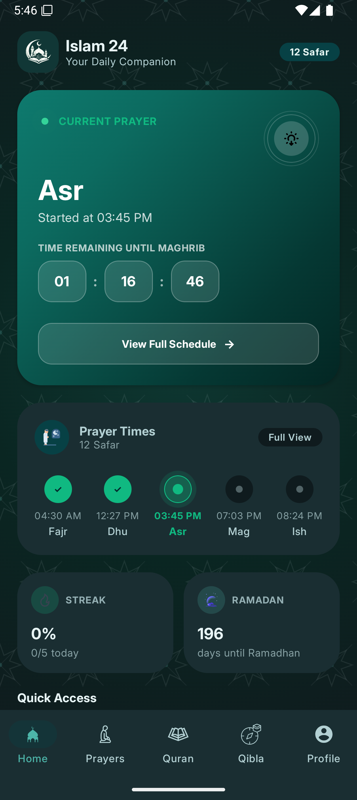
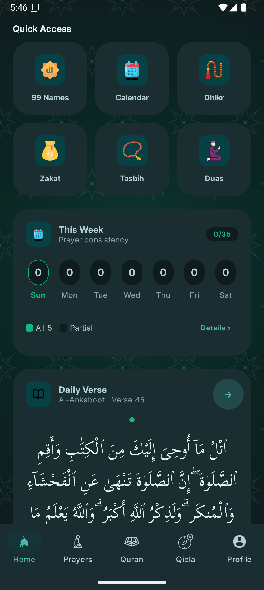
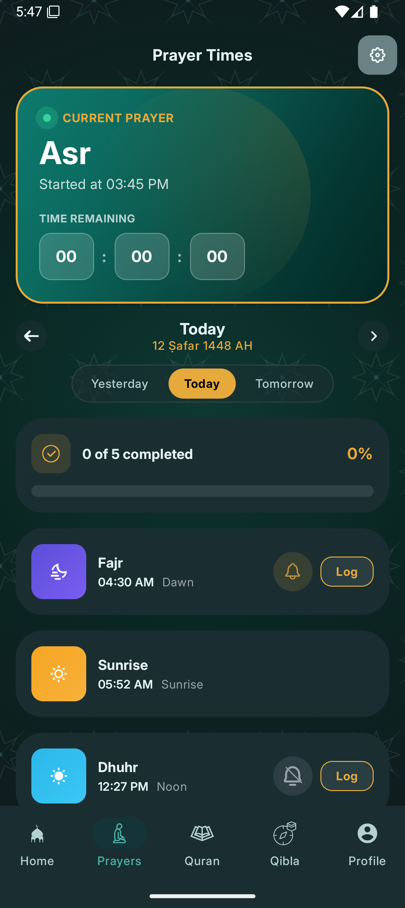
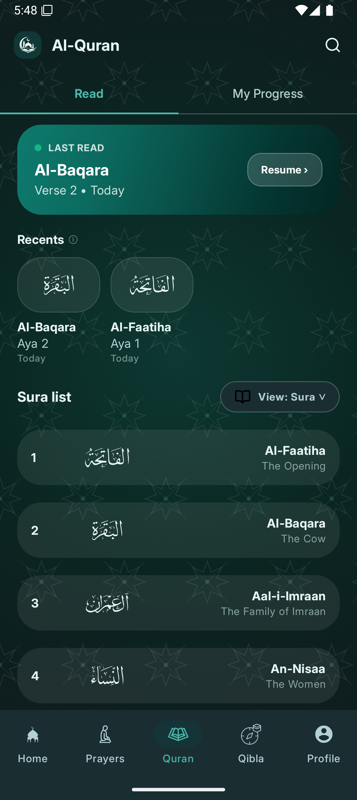
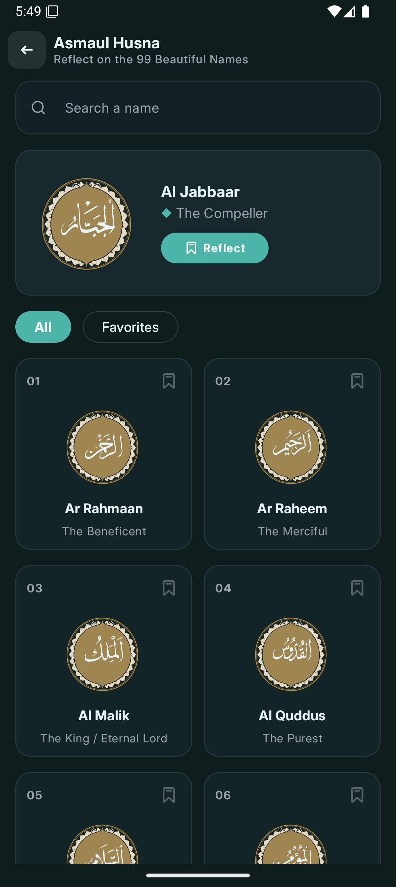

# Islam 24

A clean, modern, and completely ad-free Android app designed to assist Muslims with their daily prayers and Quranic reading. Built natively with Kotlin and Jetpack Compose, **Islam 24** respects your privacy with zero trackers and zero ads.

  

---

## Screenshots

  
  
  
  
  

---

## Features

- **🕌 Accurate Prayer Times**: Location-based calculation for Fajr, Dhuhr, Asr, Maghrib, and Isha with next prayer countdown and Adhan notifications.
- **📖 Al-Quran Al-Kareem**: Complete 114 Surahs with translations (English, Bengali, Transliteration), audio recitations, Ayah bookmarking, and a real-time "Recent Reads" slider on the home screen.
- **🧭 Qibla Compass**: Device sensor and GPS driven compass to locate the exact direction of the Kaaba.
- **📿 Digital Tasbih & Athkar**: Interactive Tasbih counter with customizable targets alongside authentic Morning, Evening, and Daily Athkar collections.
- **🌟 Asma-ul-Husna**: The 99 Beautiful Names of Allah with Arabic text, English meanings, and spiritual benefits.
- **📅 Islamic Hijri Calendar**: Track Islamic months and important events (Ramadan, Eid, Islamic New Year).
- **💰 Zakat Calculator**: Simple calculator for annual Zakat on cash savings, gold, silver, and assets.
- **🔒 Privacy First & 100% Ad-Free**: No ad banners, no popups, and no background tracking/analytics.

---

## Tech Stack

- **Language**: Kotlin 100%
- **UI Framework**: Jetpack Compose + Material 3 Design
- **Architecture**: Clean Architecture + MVVM + Multi-Module
- **Dependency Injection**: Koin
- **Local Database**: Room (with asset prepopulation & custom version migrations)
- **Background Tasks**: WorkManager & AlarmManager
- **Async & Reactive**: Kotlin Coroutines & Flows

---

## Credits & Attributions

### Icons & Media
- [Stratis UI Icons](https://www.figma.com/design/4cMgtPKTUF4Kzz3QZxGRsq/Stratis-UI-Icons---1000%2B-Free-Figma-icons-(Community)) by Stratis UI
- Feature badges and icons from [Icons8](https://icons8.com/)

### Quran Data
- **Arabic Text**: [alquran.cloud API](https://alquran.cloud/api) (`quran_ar.json`)
- **Translations**: [Risan's Quran JSON Repository](https://github.com/risan/quran-json) (`quran_en.json`, `quran_bn.json`, `quran_transliteration.json`)
- **Bengali Surah Names**: [Everything in a Place](https://allzinone.blogspot.com/2011/12/bengali-meaning-of-name-of-suras-of.html)
- **Arabic Fonts**: [Quran Android Repository](https://github.com/quran/quran_android)

---

## License

This project is licensed under the Apache License 2.0.
